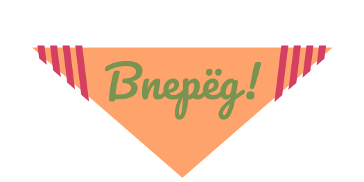

Учить Javascript теперь намного легче, чем вы думали
Этот репозиторий сделан для того, чтобы облегчить изучаемость JS. Я делал(ю) его по мере своего же обучения. Все материалы здесь собраны из всего интернета, а значит являются свободнораспространяемыми.

Мы будем изучать JS по следующему принципу:

* Теория (вкратце)
* Практика (в коде)
* Повторение (задача)

Данный способ используют все кому не лень, однако я хотел бы "изобрести велосипед" и немного дополнить данный способ.

* Теория приводится прямо в коде
* Практика неразрывно связана с прикладной задачей
* Сама задача взята не для самого легкого уровня

Так изучать что-то будет гораздно интереснее, веселее и быстрее. Также, ко всему прочему к коду будут добавлены сниппеты.

